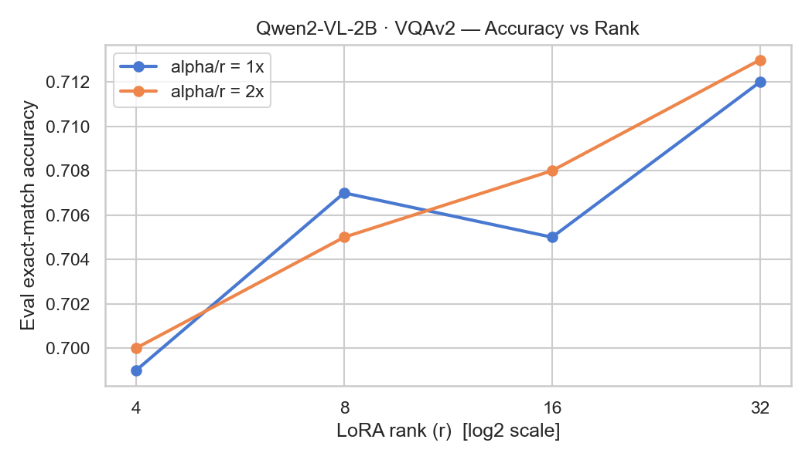
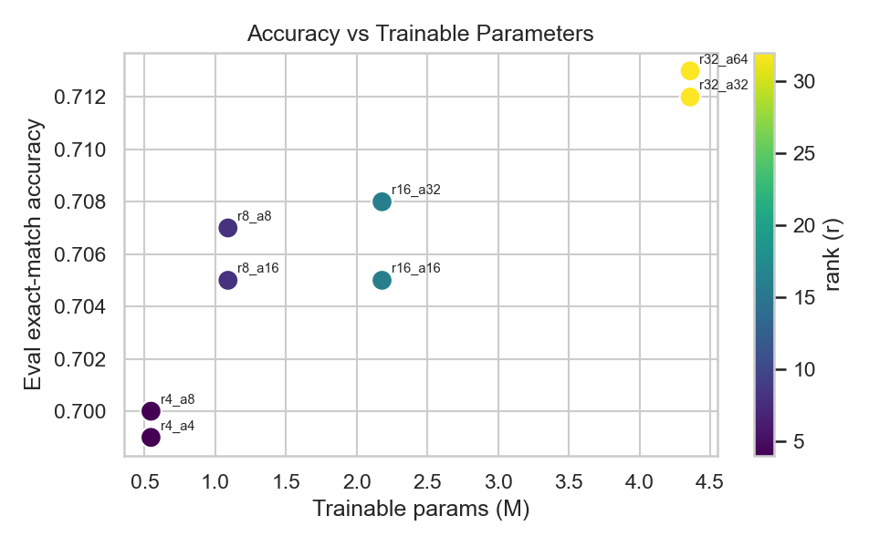

# LoRA Toy Demo — Qwen2-VL-2B + VQAv2

Rank/alpha sensitivity study. Fine-tune Qwen2-VL-2B on VQAv2 validation subset (5k rows) with varying LoRA configs, measure exact-match accuracy.

## Setup (GCP A100)

```bash
pip install -r requirements.txt
```

## Day 1 — Baseline (r=8, alpha=16)

```bash
python scripts/train.py --config configs/lora_baseline.yaml
```

## Day 2 — Sweep (r ∈ {4,8,16,32} × alpha ∈ {r, 2r})

```bash
chmod +x scripts/run_sweep.sh
./scripts/run_sweep.sh
python scripts/plot_results.py
```

## Results

Full sweep: VQAv2 `validation`, 5000-row subset (4000 train / 1000 eval), 1 epoch,
LR 2e-4 cosine, BF16, effective batch 16, single NVIDIA L4 (~21 min/run). LoRA on
`q_proj`/`v_proj`. Metric = VQA-normalized exact match on the held-out 1000.

| run | r | alpha | alpha/r | trainable params | % of model | eval acc |
|-----|---|-------|---------|-----------------|-----------|----------|
| r4_a4   | 4  | 4  | 1× | 544,768   | 0.025% | 0.6990 |
| r4_a8   | 4  | 8  | 2× | 544,768   | 0.025% | 0.7000 |
| r8_a8   | 8  | 8  | 1× | 1,089,536 | 0.049% | 0.7070 |
| r8_a16  | 8  | 16 | 2× | 1,089,536 | 0.049% | 0.7050 |
| r16_a16 | 16 | 16 | 1× | 2,179,072 | 0.099% | 0.7050 |
| r16_a32 | 16 | 32 | 2× | 2,179,072 | 0.099% | 0.7080 |
| r32_a32 | 32 | 32 | 1× | 4,358,144 | 0.197% | 0.7120 |
| r32_a64 | 32 | 64 | 2× | 4,358,144 | 0.197% | **0.7130** |




**Observations**
- **Rank dominates, with diminishing returns.** r4→r32 is an 8× jump in trainable
  params for only +1.4 pts accuracy (0.699→0.713). Capacity is not the binding
  constraint on this subset.
- **`alpha/r = 2×` helps at most ranks** (r4, r16, r32) — a larger LoRA scaling
  factor `alpha/r` acts like a higher effective learning rate on the adapter,
  which is useful on small data. r8 is the lone inversion, within run-to-run noise.
- **Best CP ratio: `r8_a16`** — 0.705 at ¼ the trainable params of r32. r32_a64 is
  the top scorer but pays 4× the params for +0.8 pts.
- A 2000-row fast sweep (`results/sweep_results.csv`) shows the same shape ~0.5–1 pt
  higher — small eval sets read optimistically; the 5000 numbers are the reliable ones.

Regenerate plots: `python scripts/plot_results.py` (defaults to the full CSV).

## Structure

```
lora-vqa-demo/
├── configs/
│   ├── lora_baseline.yaml   # Day 1 config
│   └── sweep.yaml           # Day 2 sweep matrix
├── src/
│   ├── dataset.py           # VQAv2 loader + prompt builder
│   ├── model.py             # Qwen2-VL load + LoRA wrap
│   └── metrics.py           # VQA exact-match + eval loop
├── scripts/
│   ├── train.py             # Single run entry point
│   ├── run_sweep.sh         # Day 2 sweep driver
│   └── plot_results.py      # Loss curves + accuracy plots
├── notebooks/
│   └── explore_vqa.ipynb    # Dataset exploration
├── results/
│   ├── sweep_results.csv    # Auto-appended per run
│   └── figures/             # PNG plots
└── requirements.txt
```
